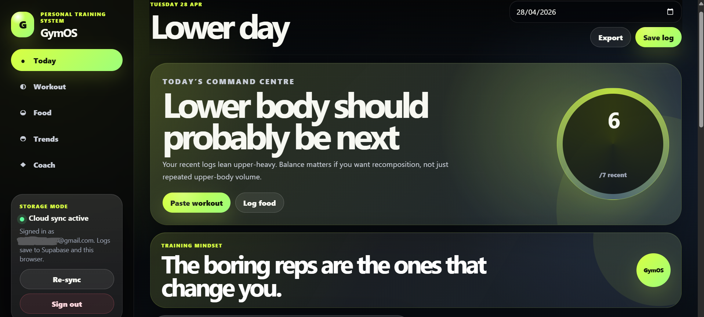
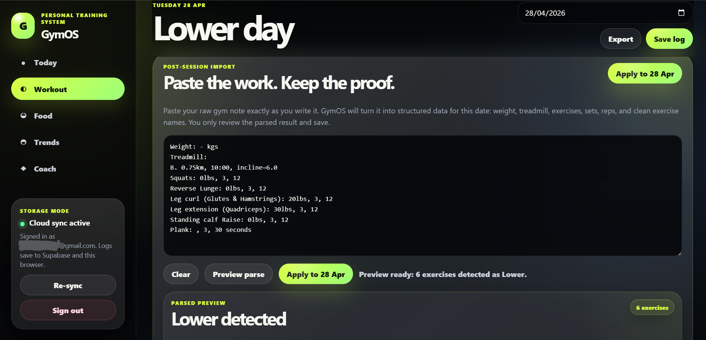
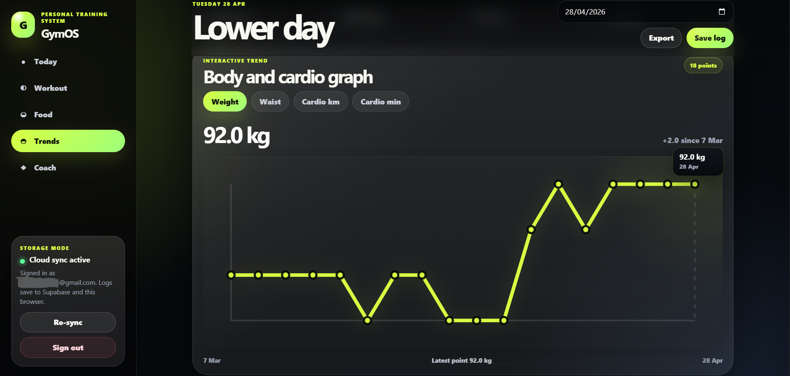
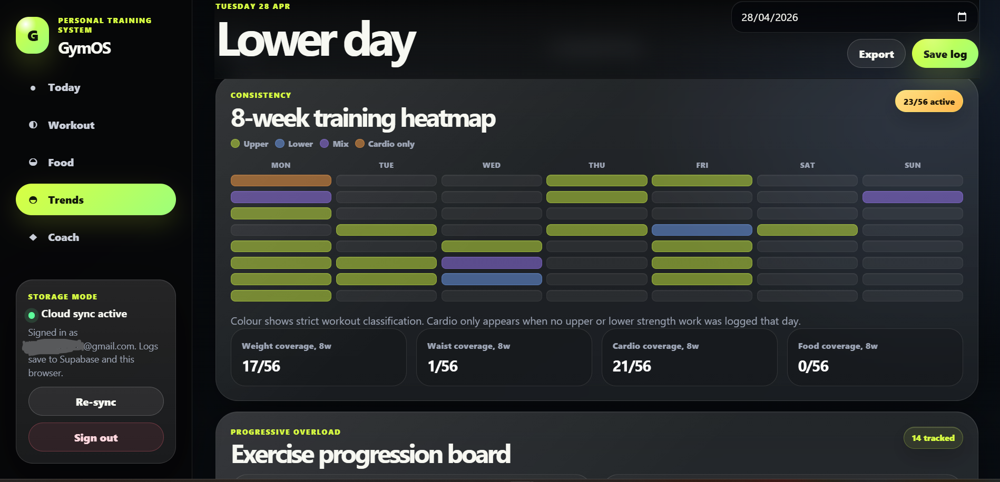
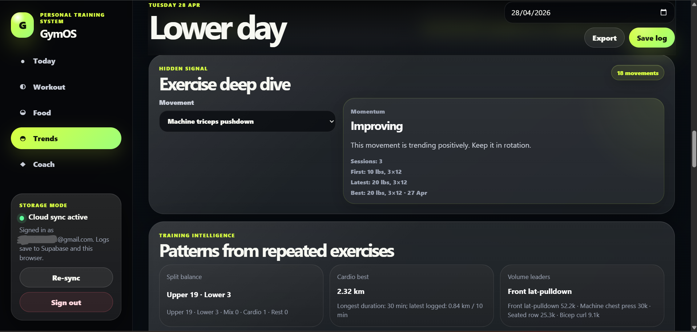
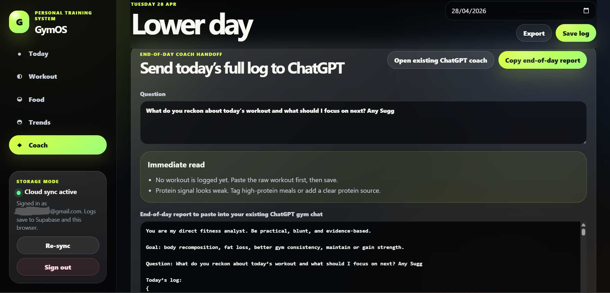
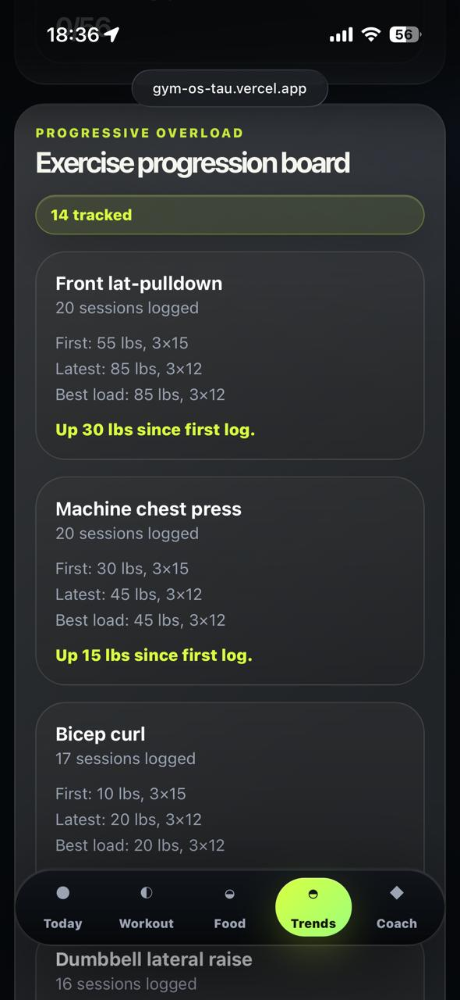

# GymOS

**GymOS** is a personal fitness tracking PWA built around one real workflow:

> Train first. Paste the raw gym note. Let the app structure, normalise, analyse, and prepare the coaching handoff.

It is not trying to replace Apple Watch, Hevy, Strong, or MyFitnessPal. GymOS is a **post-session fitness data system** for turning messy workout notes into structured training intelligence.

**Live app:** https://gym-os-tau.vercel.app  
**Repository:** https://github.com/dvp2004/GymOS

<p align="center">
  
</p>

---

## What GymOS does

GymOS helps track:

- body weight, optional waist size, and sleep
- raw workout notes pasted after training
- treadmill/cardio distance, duration, and incline
- strength exercises, load, sets, and reps
- nutrition notes and low-friction meal tags
- exercise progression, PRs, and repeated movement history
- 8-week consistency patterns
- end-of-day ChatGPT coach reports

The app is designed for one real training workflow: logging shorthand notes during or after the gym, then pasting them into GymOS at the end of the day.

---

## Core workflow

1. Pick the date.
2. Paste the raw workout note.
3. Preview the parsed result.
4. Check parser warnings.
5. Apply the workout to that date.
6. Add food/body notes.
7. Save the log.
8. Copy the coach report into ChatGPT.

Example raw workout note:

```txt
Weight: - kgs
Treadmill:
B. 0.75km, 10:00, incline=6.0
Squats: 0lbs, 3, 12
Reverse Lunge: 0lbs, 3, 12
Leg curl (Glutes & Hamstrings): 20lbs, 3, 12
Leg extension (Quadriceps): 30lbs, 3, 12
Standing calf Raise: 0lbs, 3, 12
Plank: , 3, 30 seconds
```

GymOS parses this into structured data:

- workout type
- body weight
- treadmill distance, duration, and incline
- normalised exercise names
- load
- unit
- sets
- reps
- parser warnings for suspicious entries

<p align="center">
  
</p>

---

## Key features

### Paste-first workout logging

GymOS is built around raw note ingestion rather than live workout tracking.

It can parse notes such as:

```txt
Machine Front lat-pulldown (Tricep, Bicep, Lats): 85lbs, 3, 12
Machine Chest Press (Deltoids, Traps & Triceps): 45lbs, 3, 12
Machine Shoulder Press (Deltoids, Traps & Triceps): 30lbs, 3, 12
Machine Triceps Pushdown (Triceps): 20lbs, 3, 12
Machine Seated Row (teres major): 65lbs, 3, 12
Machine Bicep-curl: 20lbs, 3, 12
```

The parser normalises messy exercise names, stores the raw note in the day’s notes, and flags suspicious values before saving.

---

### Parser preview and warnings

Before applying the workout to the selected date, GymOS can preview the parsed result.

The parser can flag issues such as:

- suspicious reps, such as `1w`
- missing sets
- missing machine/cable load
- unknown exercise names
- treadmill distance without duration
- unavailable body weight

This prevents bad data entering the dataset silently.

---

### Exercise normalisation

Messy input names are mapped to clean movement names.

| Raw input | Normalised |
|---|---|
| `Machine Chest Press (Deltoids, Traps & Triceps)` | `Machine chest press` |
| `Machine Front lat-pulldown (Tricep, Bicep, Lats)` | `Front lat-pulldown` |
| `Machine Bicep-curl` | `Bicep curl` |
| `Standing calf Raise` | `Standing calf raise` |
| `Leg curl (Glutes & Hamstrings)` | `Leg curl` |

This keeps trends and progression analysis clean.

---

### Workout classification

GymOS classifies training days using strict movement detection:

| Classification | Meaning |
|---|---|
| `Upper` | only upper-body strength exercises detected |
| `Lower` | only lower-body/core strength exercises detected |
| `Mix` | both upper and lower strength exercises detected |
| `Cardio` | cardio only, with no strength work |
| `Rest` | no workout data |

Cardio does not override strength. If treadmill is logged after an upper-body session, the day remains `Upper`.

---

### Weekly default plan

The app defaults to this weekly structure:

| Day | Default |
|---|---|
| Monday | Upper |
| Tuesday | Lower |
| Wednesday | Upper |
| Thursday | Lower |
| Friday | Upper |
| Saturday | Rest |
| Sunday | Rest |

The default can be changed manually for a specific day.

---

## Trends and analytics

GymOS includes:

- 7-day and 14-day weight averages
- cardio distance and duration trends
- 8-week training heatmap
- 56-day consistency score
- data coverage cards
- exercise progression board
- volume leaders
- split balance
- exercise deep-dive
- hover/tap chart tooltips

<p align="center">
  
</p>

<p align="center">
  
</p>

---

## Exercise intelligence

GymOS tracks repeated exercises and shows:

- first logged performance
- latest performance
- best performance
- session count
- PR badges
- `NEW` movement badges
- `Matches best`
- `Up vs last`
- `Below last`
- exercise momentum

Best performance prioritises **load first**, then reps and sets. For example:

```txt
65 lbs × 3 × 12 > 55 lbs × 3 × 15
```

This avoids inflated high-rep volume being treated as better than a heavier lift.

<p align="center">
  
</p>

---

## Nutrition tags

Food logging is intentionally lightweight.

Instead of calorie counting, GymOS supports meal notes and tags such as:

- High protein
- Low protein
- Heavy carbs
- Light meal
- Restaurant
- Pre-workout
- Post-workout
- Late meal
- Hydration poor

These tags are stored for future analysis and coach reports.

---

## Coach handoff

GymOS does not currently run an in-app LLM chat.

Instead, it generates a structured end-of-day report that can be copied into an existing ChatGPT fitness chat.

The report includes:

- today’s full log
- recent trend summary
- workout comparison
- exercise-level comparisons
- cardio trend
- nutrition tag summary
- recent logs
- specific questions for feedback

<p align="center">
  
</p>

This is deliberate. It avoids exposing API keys in the frontend and keeps the existing ChatGPT coaching workflow intact.

---

## Mobile/PWA support

GymOS is built as a Progressive Web App and can be added to the iPhone Home Screen.

On iPhone:

1. Open the live app in Safari.
2. Tap Share.
3. Tap **Add to Home Screen**.
4. Use it like a native app.

<p align="center">
  
</p>

---

## Data storage

GymOS stores data in Supabase Postgres when signed in.

Main tables:

| Table | Purpose |
|---|---|
| `daily_logs` | one row per date |
| `exercise_entries` | exercises linked to a daily log |
| `meal_entries` | meals linked to a daily log |

The app also uses browser `localStorage` as a local fallback/cache.

Row Level Security policies restrict users to their own rows.

---

## Inspecting the database

In Supabase:

```txt
Supabase → Table Editor
```

Open:

```txt
daily_logs
exercise_entries
meal_entries
```

To view a joined dataset, run this in Supabase SQL Editor:

```sql
select
  dl.id,
  dl.user_id,
  dl.log_date,
  dl.weight_kg,
  dl.waist_size_cm,
  dl.sleep_hours,
  dl.workout_type,
  dl.gym_time,
  dl.pre_workout,
  dl.treadmill_distance_km,
  dl.treadmill_minutes,
  dl.treadmill_incline,
  dl.notes,
  dl.created_at,
  dl.updated_at,
  coalesce(
    json_agg(
      distinct jsonb_build_object(
        'exercise_name', ee.exercise_name,
        'weight', ee.weight,
        'unit', ee.unit,
        'sets', ee.sets,
        'reps', ee.reps,
        'completed_sets', ee.completed_sets,
        'position', ee.position
      )
    ) filter (where ee.id is not null),
    '[]'
  ) as exercises,
  coalesce(
    json_agg(
      distinct jsonb_build_object(
        'label', me.label,
        'description', me.description,
        'protein_score', me.protein_score,
        'tags', me.tags,
        'position', me.position
      )
    ) filter (where me.id is not null),
    '[]'
  ) as meals
from public.daily_logs dl
left join public.exercise_entries ee
  on ee.daily_log_id = dl.id
left join public.meal_entries me
  on me.daily_log_id = dl.id
group by dl.id
order by dl.log_date desc;
```

---

## Tech stack

- React
- TypeScript
- Vite
- Supabase Auth
- Supabase Postgres
- Supabase Row Level Security
- Vercel
- PWA manifest/service worker
- Vitest parser tests

---

## Local development

Install dependencies:

```bash
npm install
```

Run locally:

```bash
npm run dev
```

Build:

```bash
npm run build
```

Run parser tests:

```bash
npm run test:parser
```

---

## Environment variables

Create a local `.env` file:

```bash
VITE_SUPABASE_URL=https://your-project-ref.supabase.co
VITE_SUPABASE_ANON_KEY=your-public-anon-key
VITE_EXISTING_CHATGPT_COACH_URL=https://chatgpt.com/your-existing-chat-url
```

For Vercel, add the same variables in:

```txt
Vercel → Project → Settings → Environment Variables
```

Never commit `.env`.

---

## Supabase setup

1. Create a Supabase project.
2. Open SQL Editor.
3. Run the schema in `supabase/schema.sql`.
4. Enable Authentication.
5. Add Google OAuth if desired.
6. Copy the Supabase project URL and anon key into `.env`.
7. Add the same environment variables in Vercel.
8. Redeploy.

---

## Google sign-in

To enable Google sign-in:

1. Supabase → Authentication → Providers → Google.
2. Copy the Supabase callback URL.
3. Google Cloud Console → create OAuth Client ID → Web application.
4. Add local and production origins:
   - `http://localhost:5173`
   - `https://gym-os-tau.vercel.app`
5. Add the Supabase callback URL as an authorised redirect URI.
6. Paste the Google Client ID and Client Secret into Supabase.
7. Enable the provider.
8. Supabase → Authentication → URL Configuration → add the local and production redirect URLs.

GymOS only needs identity sign-in. It does not need Gmail scopes.

---

## Importing old logs

Open:

```txt
Trends → Import old logs
```

Paste or upload a JSON array.

`date` is the only required field. All other fields can be blank.

Example:

```json
[
  {
    "date": "2026-04-08",
    "weightKg": "92",
    "waistSizeCm": "",
    "sleepHours": "",
    "workoutType": "Upper",
    "gymTime": "10:15-11:45",
    "preWorkout": "2 bananas + latte",
    "treadmillDistanceKm": "1.00",
    "treadmillMinutes": "11:58",
    "treadmillIncline": "6.0",
    "notes": "Felt tired after gym",
    "exercises": [],
    "meals": []
  }
]
```

Missing values such as `-`, `n/a`, blank strings, and em dashes are imported as unavailable, not zero.

---

## Parser tests

GymOS includes regression tests for the raw workout parser.

The tests cover:

- upper-day parsing
- lower-day parsing
- pure cardio classification
- mixed upper/lower classification
- cardio not overriding strength classification
- suspicious reps typos
- exercise alias normalisation

Run:

```bash
npm run test:parser
```

Any real parser failure should become a new test case.

---

## Screenshots

Screenshots are stored in:

```txt
docs/screenshots/
```

Current screenshots:

```txt
01-today-dashboard.png
02-workout-parser-preview.png
03-trends-heatmap-chart.png
03-trends-heatmap-chart2.png
04-exercise-deep-dive.png
05-coach-handoff.png
06-mobile-pwa.jpeg
```

If the repository is public, use screenshots with dummy data or blur personal values.

---

## Privacy note

Do not commit:

```txt
.env
real Supabase credentials
personal ChatGPT conversation URLs
real private health/fitness exports
```

The `.env` file must stay local and in Vercel environment variables only.

---

## Current product direction

GymOS is not a live workout timer.

Apple Watch handles live session tracking. GymOS handles:

```txt
raw note → parser → structured data → trends → coach handoff
```

The next serious product upgrade is inline correction in the parsed preview, so suspicious values can be fixed before applying the workout to the day.

---

## Roadmap

Short-term:

- inline correction inside parsed preview
- CSV export
- better parser coverage for messy real-world note formats
- coach report quality improvements

Medium-term:

- nutrition/sleep correlation analysis once enough tagged data exists
- admin/data tab for raw dataset inspection
- optional native OpenAI coach through a backend function

Not planned right now:

- live workout timer
- full calorie counting
- replacing Apple Watch
- replacing ChatGPT conversation history